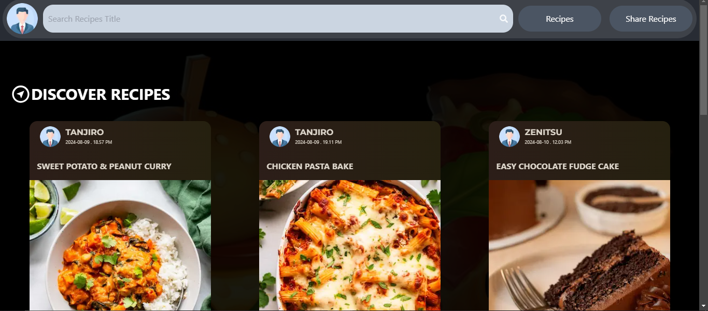
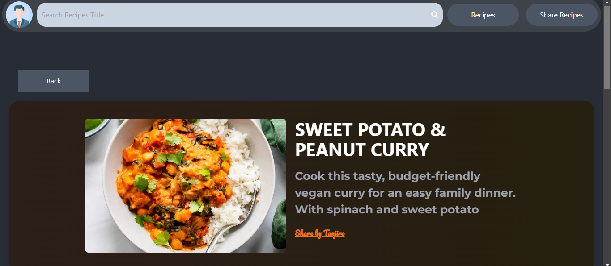
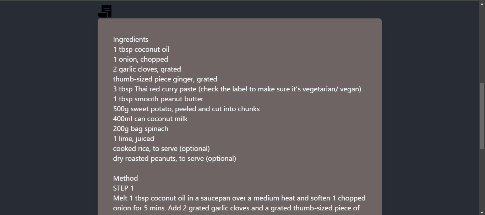
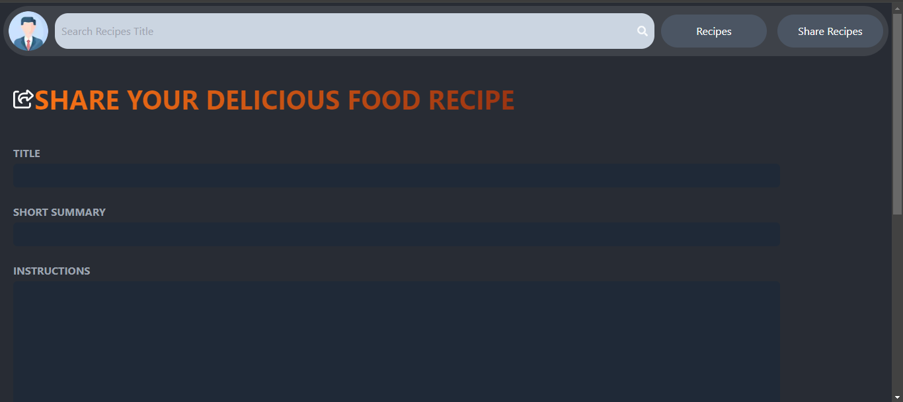
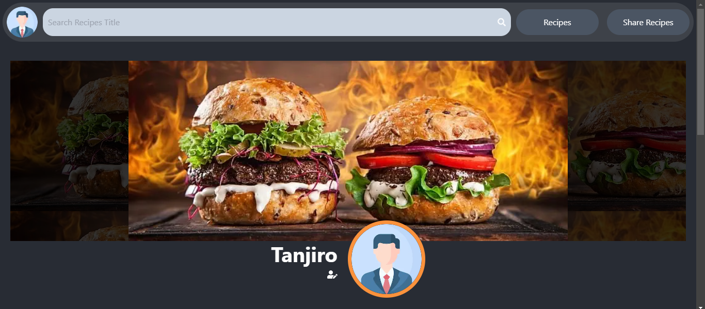
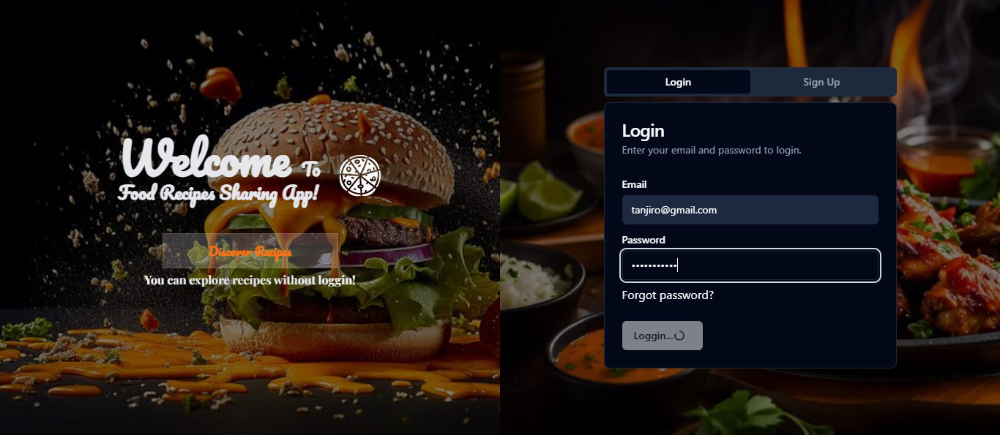

# 🍽️ __Food Recipes Sharing App__ - (Fullstack nextjs app)
 __A full-stack web application built with Next.js__ where users can discover, share, and manage their favorite recipes. It features modern authentication, smooth UI interactions, and powerful performance optimizations, as well as image handling (Cloudinary).

# ✨ Technologies
- Next.js 14 (App Router)
- React.js
- JavaScript
- Node.js
- MongoDB & Mongoose
- JWT (JOSE)
- Tailwind CSS & Shadcn UI
- Zod (Validation)
- Framer Motion

# 🚀 Key Features

## 🔎 Discover Recipes
Explore delicious recipes shared by others.
- Like/dislike instantly using React Optimistic UI
- Next.js caching ensures fast page loads
- Smooth animations with Framer Motion

## 📝 Share Recipes
Users can contribute by sharing their own recipes.
- Add title, summary, instructions, and image
- Form validation with Zod
- Real-time UX feedback with useFormState
- Inline error messages for a clean form experience

# 👤 Profile Page
Manage your own profile and recipes.
- Update profile info with real-time form validation
- See and manage your shared recipes
- Dynamic animations using Framer Motion + React state

# 🔐 Authentication & Authorization
Robust authentication using JWT + JOSE
- Secure login/signup
- Protected routes via Next.js Middleware
- DAL (Data Access Layer) and DTO (Data Transfer Object) for cleaner, safer data handling

# ⚙️ Optimization
- Next.js Image Component for better image performance
- Dynamic metadata rendering for SEO
- Efficient data fetching using Next.js Cache + React Cache
- Avoids redundant DB calls
- Revalidates only if data changes

 

# 🛠️ Error Handling
- Backend wrapped with try/catch for reliability
- React Error Boundaries provide user-friendly error messages and allow recovery without page refresh

# 🌐 Live Demo
- 🔗 Visit the App - https://nextgenrecipes.netlify.app

## 🧪 Use the following credentials to test:
 **Email - test@gmail.com**\
 **Password - test123!**\
Or feel free to create your own account and test the full authentication flow!

## 🎯 Final Note
This project is a complete full-stack application built to deliver a seamless recipe-sharing experience. From powerful server-side rendering to smooth UI animations, it reflects modern web development best practices and offers a solid user journey from start to finish.
