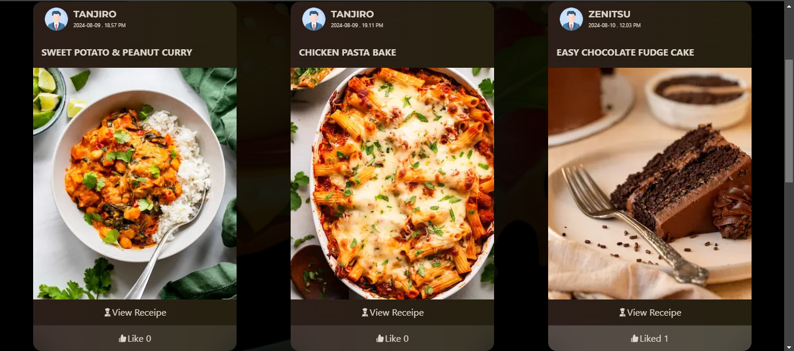

# __FOOD RECIPES SHARING APP__ - (Fullstack nextjs app)
 Developed a __full-stack web application using Next.js__ for users to discover, share, and manage recipes. Implemented robust authentication (JWT), data management (Mongoose, DAL, DTO), and image handling (Cloudinary). Optimized performance with Next.js caching and enhanced user experience with smooth animations (Framer Motion).
 
 

 ## __DISCOVER RECIPES PAGE__
 On this page, users can __explore, like/dislike, and view__ delicious recipes other users shared. I have used __React Optimistic__ to instantly update the UI when users like/dislike the post to provide a better user experience.
 It uses the __nextjs cache data__ feature in the server and client to quickly load the page and show the recipe without giving a long loading time to the user.
 

 ## __SHARE RECIPE__
 The share recipe page, allows user to __share__ their favorite recipe with an attractive title, summary, instructions, and image of the recipe. Here I have used __ZOD to validate the form data.__. I have provided a better __UX experience by showing the loading status after submitting the form using nextjs useFormState, showing appropriate errors below each input field.__
 

 ## __PROFILE PAGE__
 In the profile section, user can __update their profile and manage recipes__ shared by them. Here I have used nice cover photo transition animation using __react useState and framer motion.__ I have also used __ZOD__ to validate form data.
 

 ## __AUTHENTICATION AND AUTHORIZATION__
 I have used __JWT__ to implement robust authentication using __the JOSE library__ to __encrypt__ and __decrypt__ the __session__. I use __middleware__ to protect private routes and in addition to that, I have implemented __a Data access layer(DAL)__ in each server's actions to provide high security and __a Data transfer object(DTO)__ to return only the necessary data for authenticated users.

 ## __OPTIMISATION__
 for this, I used __nextjs image component__ for a better UX experience and rendered __metadata dynamically__ of each recipe page for __SEO optimization__. To serve fast data access to users I have used __the react cache feature and nextjs cache__ on constantly accessing __server actions__ to send __a single request__ to the server actions and __serve the same data (revalidate if the data changed!)__ without sending the same request to the database and other resources.
 
 

 ## __ERROR HANDLING__
 To make the app stable I have used __try/catch__ block for server actions. To enable users to __recover from errors__, I have used __the react error boundary__ to show the user a friendly error message and provide a mechanism to recover from error (Which re-renders the component/action).

 ### Technologies Used: Javascript, React.js, Nextjs(app router), Node.js, MongoDB/Mongoose, JWT, Tailwind CSS, Shadcn UI, Framer motion

 #### Visit the link - https://nextgenrecipes.netlify.app

use this email and password for testing -\
 **Email - test@gmail.com**\
 **Password - test123!**

 #### feel free to create a new account and test the user authentication.
